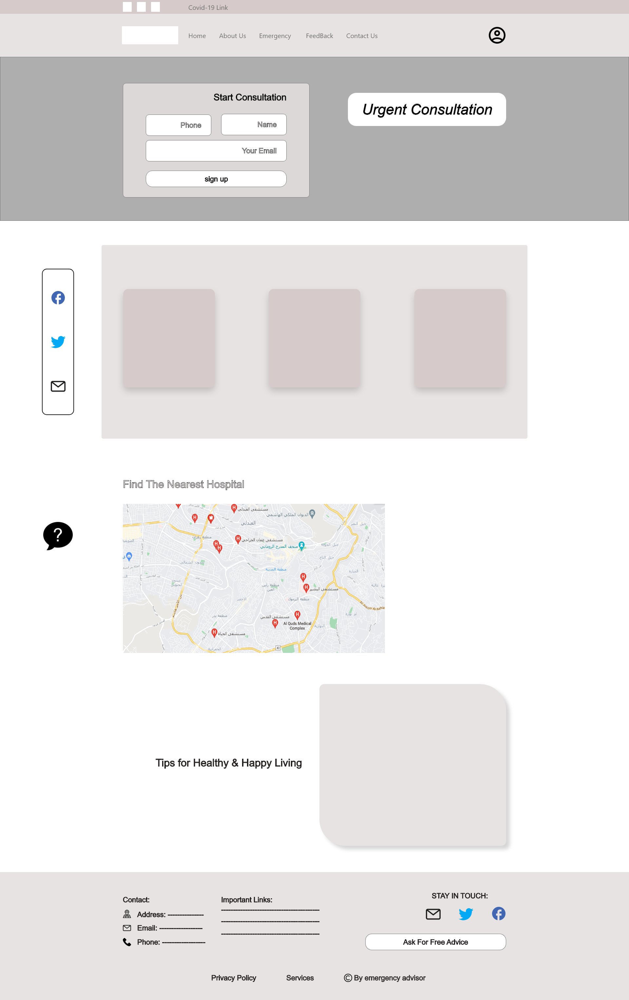
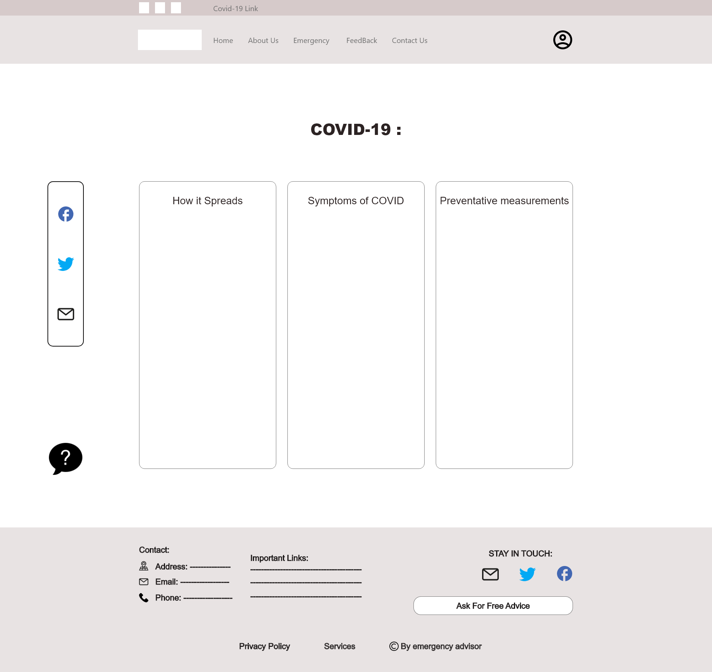
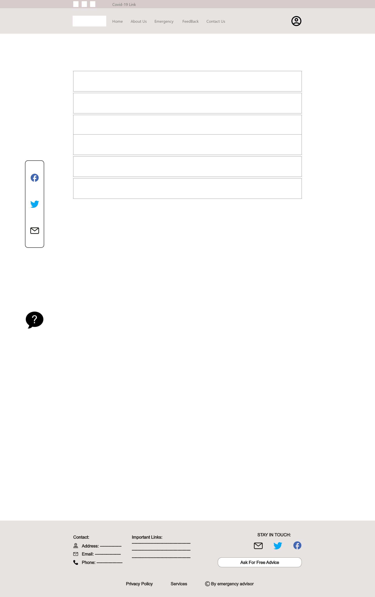
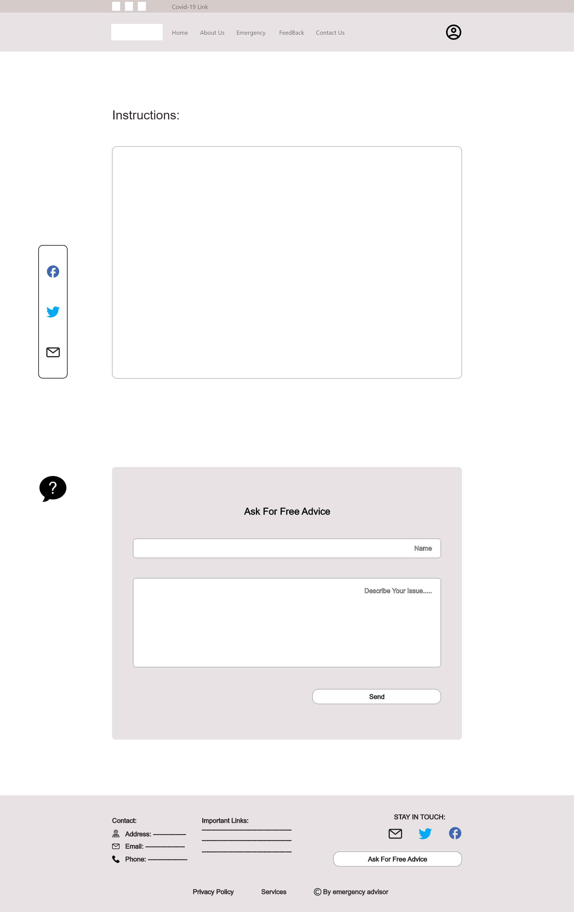
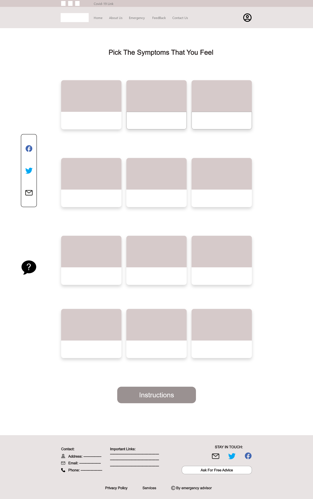

# emergency-advisor

## User Stories:

**Title**: finding the nearest hospital. 

**Sentence**: as a user or patient, I want to find the nearest hospital to me so that I will be able to find a map on the main page to check that. 

**Feature tasks**: including an iframe that will link to a specific google maps page with pin points showing the nearest hospitals 

**acceptance tests**: if the iframe is sized correctly and shows the nearest hospitals 

------------------------------------------------------------------------------------------------------------------------------------------------------------------
 

**Title**: diagnostics and immediate interference 

**Sentence**: As a user, I want to have fast diagnostics or instructions to deal with someone in front of me who is having an emergency, so that I can try to help until the ambulance arrives. 

**Feature tasks**: including a unique visible button to redirect the user to the symptoms page. 

**acceptance tests**: if the button is easily visible and accessible and redirects the user to the symptoms page. 

------------------------------------------------------------------------------------------------------------------------------------------------------------------

 
 

**Title**: covid19 updates and tips 

**Sentence**: As a user, I want to learn about the latest news and updates on COVID19, so I will be able to move to that section with ease from the home page. 

**Feature tasks**: to add another page with various information about the latest news on COVID19 and some tips and cautionary measures 

**acceptance tests**: if the section redirects the user to the covid19 page with no issues  

 -----------------------------------------------------------------------------------------------------------------------------------------------------------------

 

**Title**: chronic disease tips and cautionary measures 

**Sentence**: As a user, I might be having or anyone I know some kind of a chronic disease, so I want to learn about it be clicking on the navigation section that will redirect me to that page. 

**Feature tasks**: to have a page that will show some information and tips to do based on the chronic disease the user chooses. 

**acceptance tests**: if the page shows correctly the information related to the disease based on the user’s selection. 

 ------------------------------------------------------------------------------------------------------------------------------------------------------------------

 

**Title**: tips to deal with people having special chronic medical conditions 

**Sentence**: As a user I find it nice to move to a section showing me some tips on how to deal with people having chronic diseases in order to help me deal with those around me having some of these diseases. 

**Feature tasks**: to have a page that will show some information and tips to follow based on the chronic disease the user chooses. 

**acceptance tests**: if the allocated page shows correctly the information related to dealing with the person having a special condition based on the user’s selection 

------------------------------------------------------------------------------------------------------------------------------------------------------------------

 

**Title**: user profile 

**Sentence**: As I user, I expect to have my own account so that I can refer to my information and search history to help me save time instead of repeating the whole search process. 

**Feature tasks**: to have a form and based on the info the user enters it will save his or her searches or selections so that he can access them fast. 

**acceptance tests**: if when the user accesses his or her profile and see his history 

 ------------------------------------------------------------------------------------------------------------------------------------------------------------------

 

**Title**: tips 

**Sentence**: As a user, I find it nice and useful to have a page showing some daily random tips just to enrich my knowledge and maybe to help me deal with unexpected situations related to medical conditions or accidents. 

**Feature tasks**: to have a page that will show the user a random tip based on an algorithm that will show a random tip from an object storing a set of tips. 

**acceptance tests**: if every time the user moves to the tips page he should see a tip that is different from the one he or she saw the last time they saw it. 

 
## WireFrame

